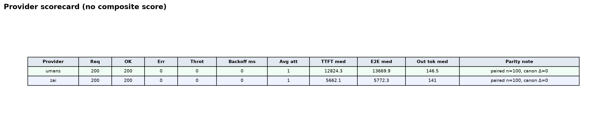
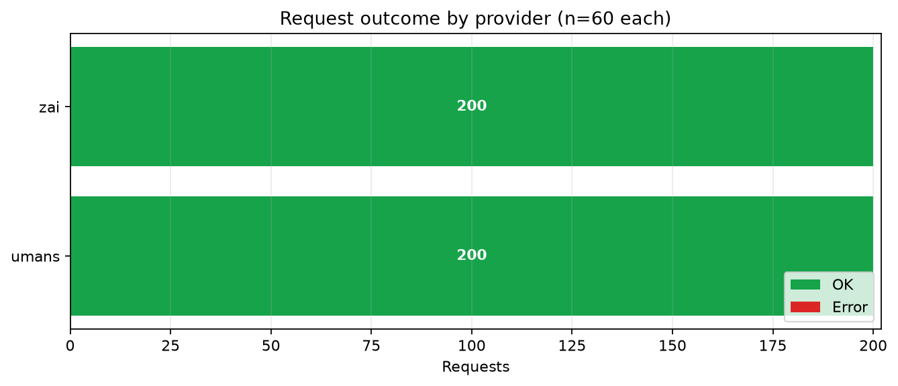
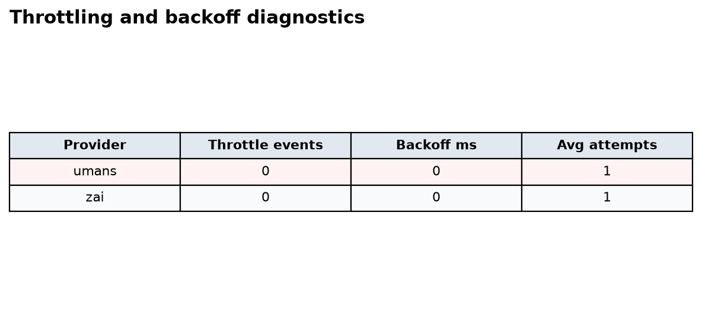
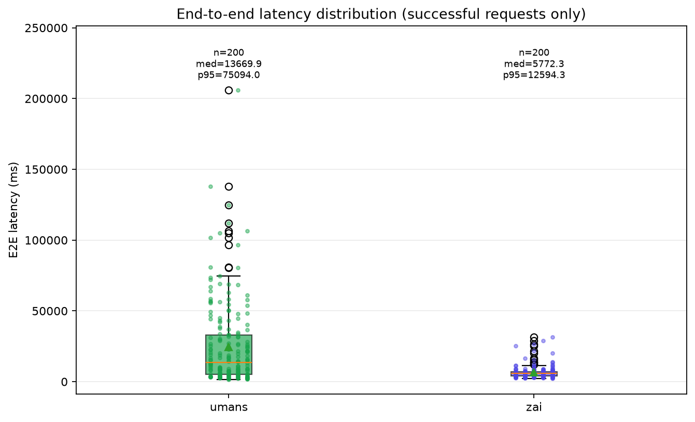
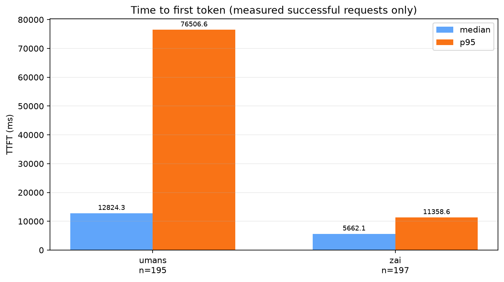
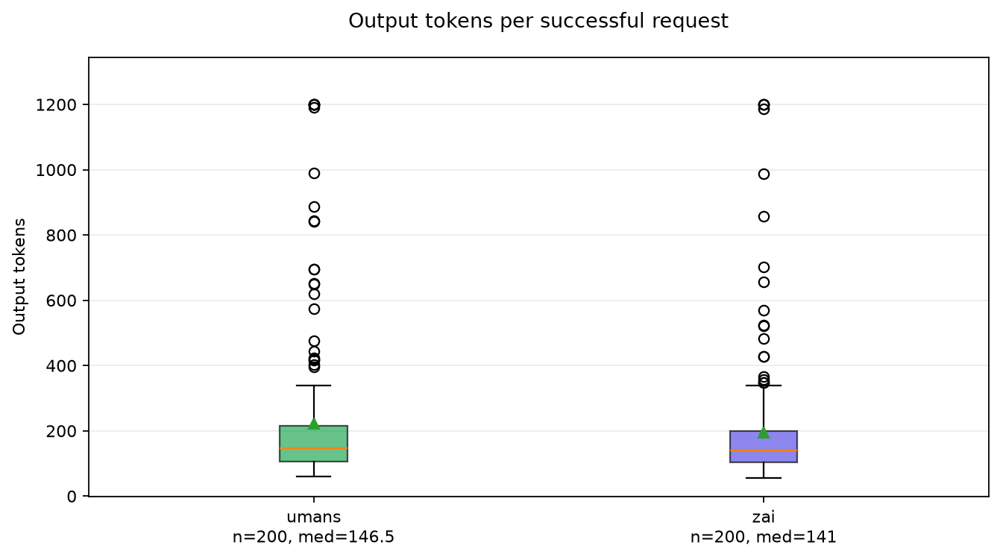
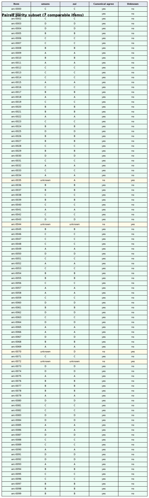

# GLMsBench ARC n=100 Provider Decision Report

## Executive summary

Both providers completed the merged ARC n=100 comparison cleanly: umans 200/200 OK; Z.ai 200/200 OK with zero throttles. Z.ai had the best median E2E latency; Z.ai had the best p95 tail latency. On strict task success, Z.ai led with 95.0%. Quality failures were a mix of parsed wrong answers and empty/non-parseable outputs, including length-stop cases at the 1200-token completion budget.

This report compares umans and Z.ai serving GLM-5.2 on a 100-item ARC sample. It uses 400 total requests across 2 providers.

## Run facts

| Field | Value |
|---|---:|
| Requests | 400 |
| Providers | umans and Z.ai |
| Suites | arc |

## Provider summary

| Provider | OK / Total | TTFT p50 | TTFT p95 | E2E p50 | E2E p95 | Output tok p50 | Throttles |
|---|---:|---:|---:|---:|---:|---:|---:|
| umans | 200 / 200 | 12824.3 | 76506.6 | 13669.9 | 75094.0 | 146 | 0 |
| Z.ai | 200 / 200 | 5662.1 | 11358.6 | 5772.3 | 12594.3 | 141 | 0 |

## Parity

| Suite | Compared | Canonical disagreements | Unknown | Disagreement rate | Raw text agreement |
|---|---:|---:|---:|---:|---:|
| arc | 100 | 0 | 4 | 0.0% | 96.0% |

## Quality and correctness

This section scores ARC outputs against gold labels. It separates answered-only accuracy from strict task success, where strict success means the request emitted a parseable correct answer.

| Provider | Correct / requests | Strict success | Answered-only accuracy | Empty content | Exact single-letter | Length stops |
|---|---:|---:|---:|---:|---:|---:|
| umans | 187 / 200 | 93.5% | 96.9% | 5 | 193 | 5 |
| Z.ai | 190 / 200 | 95.0% | 97.4% | 3 | 192 | 3 |

**Interpretation:** this 100-item sample contains both parsed wrong answers and empty/non-parseable answers. Length-stop cases consumed the 1200-token completion budget, so strict task success captures format reliability and completion budget pressure in addition to ARC correctness.

| Item-level pattern | Value |
|---|---:|
| Both providers correct on both passes | 92 / 100 |
| Items with any empty/non-parseable output | 6 / 100 |

See `quality/deep_quality_report.md` and `quality/item_correctness.csv` for item-level details.

## Charts

### Provider scorecard

*Head-to-head scorecard generated from normalized provider summary data; no composite winner score is used.*

### Request outcome by provider

*Request outcomes per provider: umans 200/200 OK; Z.ai 200/200 OK.*

### Throttling and backoff diagnostics

*Provider lifecycle diagnostics: umans 0 throttles, 0 ms backoff; Z.ai 0 throttles, 0 ms backoff.*

### End-to-end latency distribution

*Successful requests only: umans n=200, median 13670 ms, p95 75094 ms; Z.ai n=200, median 5772 ms, p95 12594 ms.*

### Time to first token

*Measured time to first token on successful requests with TTFT available: umans n=195, median 12824 ms, p95 76507 ms; Z.ai n=197, median 5662 ms, p95 11359 ms.*

### Output token distribution

*Successful responses only: umans median 146 tokens, p95 702; Z.ai median 141 tokens, p95 522. Max observed output 1200 tokens indicates completion-budget pressure on length-stop cases.*

### Paired parity subset

*Paired arc subset: 100 comparable items, 0 canonical disagreements, 4 unknown extractions, 96.0% raw text agreement.*
