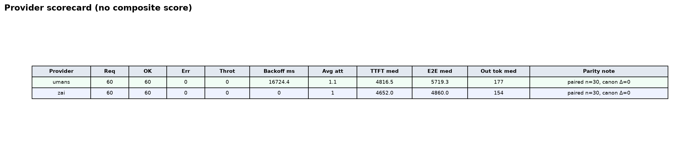
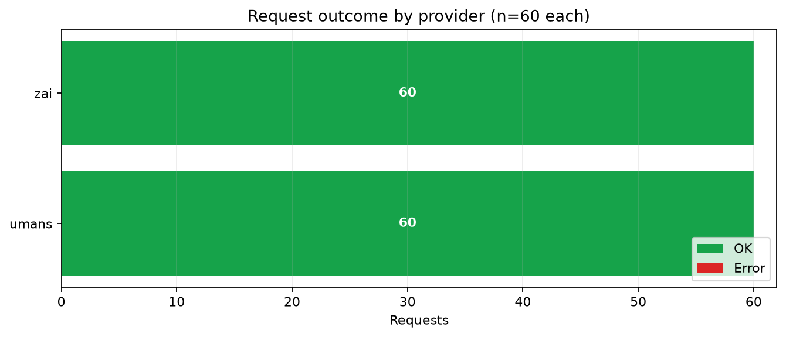
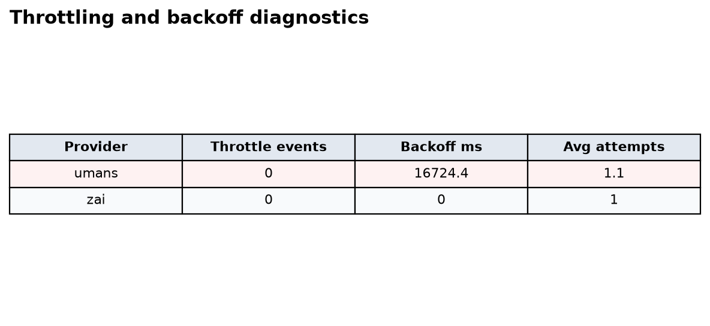
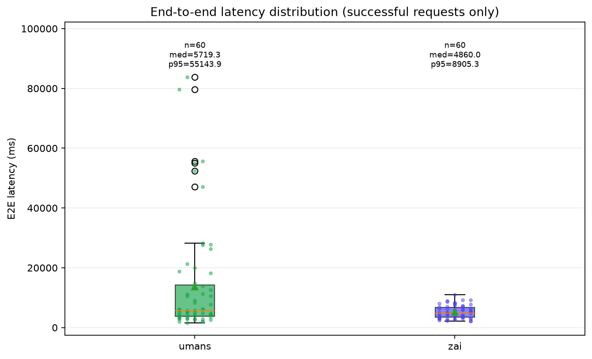
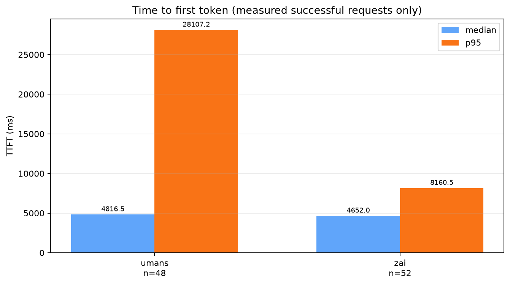
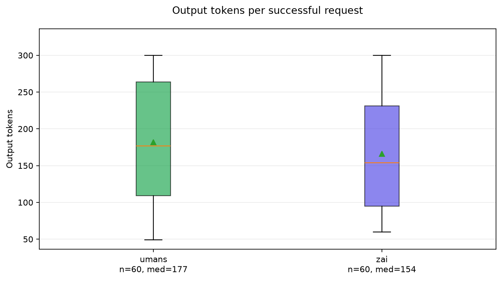
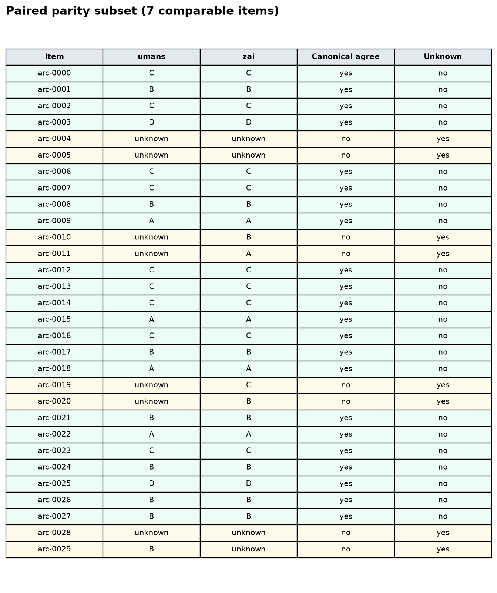

# GLMsBench ARC n=30 Provider Decision Report

## Executive summary

Both providers completed the merged ARC n=30 comparison cleanly: umans and Z.ai had 60/60 OK requests with zero throttles. Z.ai had the best median E2E latency; Z.ai had the best p95 tail latency. On strict task success, Z.ai led with 86.7%. The main quality failure mode was not wrong parsed answers, but empty visible answers after exhausting the 300-token reasoning budget.

This report compares Z.ai and umans serving GLM-5.2 on a 30-item ARC sample. It is a small but chartable run designed to validate the benchmark-to-report workflow before scaling.

## Run facts

| Field | Value |
|---|---:|
| Requests | 120 |
| Providers | umans and Z.ai |
| Suites | arc |

## Provider summary

| Provider | OK / Total | TTFT p50 | TTFT p95 | E2E p50 | E2E p95 | Output tok p50 | Throttles |
|---|---:|---:|---:|---:|---:|---:|---:|
| umans | 60 / 60 | 4816.5 | 28107.2 | 5719.3 | 55143.9 | 177 | 0 |
| Z.ai | 60 / 60 | 4652.0 | 8160.5 | 4860.0 | 8905.3 | 154 | 0 |

## Parity

| Suite | Compared | Canonical disagreements | Unknown | Disagreement rate | Raw text agreement |
|---|---:|---:|---:|---:|---:|
| arc | 30 | 0 | 8 | 0.0% | 80.0% |

## Quality and correctness

This section scores ARC outputs against gold labels. It separates answered-only accuracy from strict task success, where strict success means the request emitted a parseable correct answer.

| Provider | Correct / requests | Strict success | Answered-only accuracy | Empty content | Exact single-letter | Length stops |
|---|---:|---:|---:|---:|---:|---:|
| umans | 48 / 60 | 80.0% | 100.0% | 12 | 48 | 12 |
| Z.ai | 52 / 60 | 86.7% | 100.0% | 8 | 51 | 8 |

**Interpretation:** among parseable answers, both providers were correct on this small sample. The quality gap comes from empty visible answers that hit `stop_reason=length` after consuming the 300-token completion budget, not from parsed wrong answers.

| Item-level pattern | Value |
|---|---:|
| Both providers correct on both passes | 22 / 30 |
| Items with any empty/non-parseable output | 8 / 30 |

See `quality/deep_quality_report.md` and `quality/item_correctness.csv` for item-level details.

## Charts

### Provider scorecard

*Head-to-head scorecard generated from normalized provider summary data; no composite winner score is used.*

### Request outcome by provider

*Request outcomes per provider: umans 60/60 OK; Z.ai 60/60 OK.*

### Throttling and backoff diagnostics

*Provider lifecycle diagnostics: umans 0 throttles, 16724 ms backoff; Z.ai 0 throttles, 0 ms backoff.*

### End-to-end latency distribution

*Successful requests only: umans n=60, median 5719 ms, p95 55144 ms; Z.ai n=60, median 4860 ms, p95 8905 ms.*

### Time to first token

*Measured time to first token on successful requests with TTFT available: umans n=48, median 4816 ms, p95 28107 ms; Z.ai n=52, median 4652 ms, p95 8160 ms.*

### Output token distribution

*Successful responses only: umans median 177 tokens, p95 300; Z.ai median 154 tokens, p95 300. p95 at 300 indicates completion-budget pressure.*

### Paired parity subset

*Paired arc subset: 30 comparable items, 0 canonical disagreements, 8 unknown extractions, 80.0% raw text agreement.*
